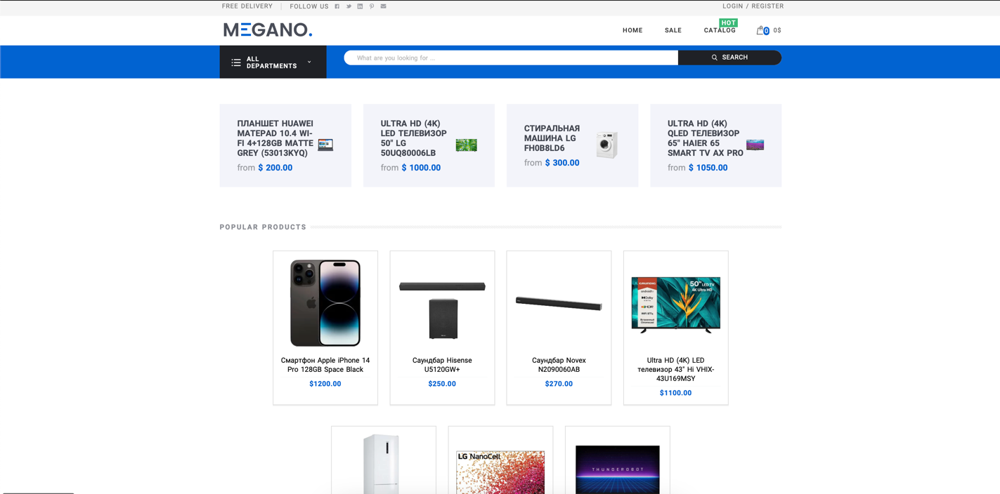

# Интернет-автосалон MEGANO


## Установка проекта

Чтобы проект работал корректно, необходимо установить все необходимые зависимости командой:
```
pip install -r requirements.txt
```
Запуск сервера выполняется в директории `megano` командой:
```
python manage.py runserver
```
Для доступа в админку небходимо создать суперпользователя командой в терминале:
```
python manage.py createsuperuser
```

